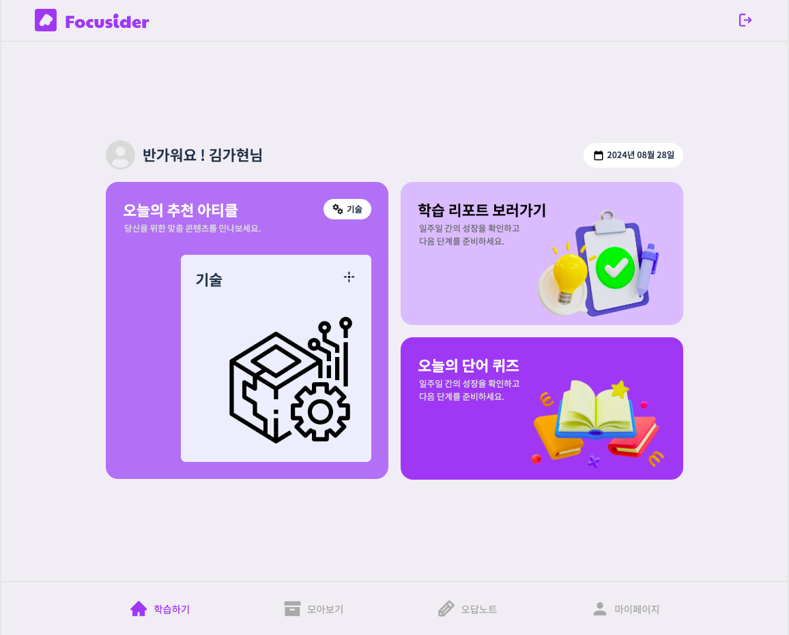
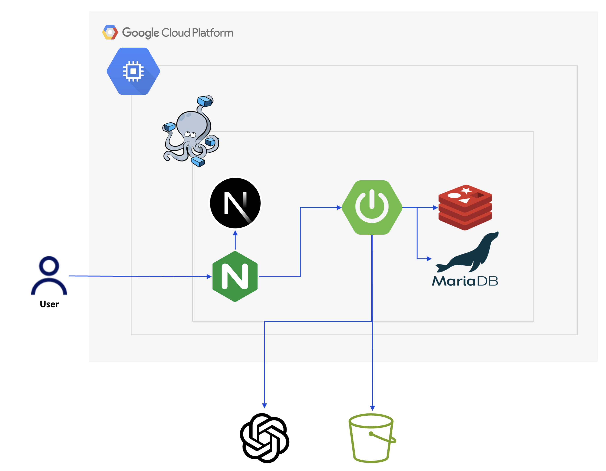
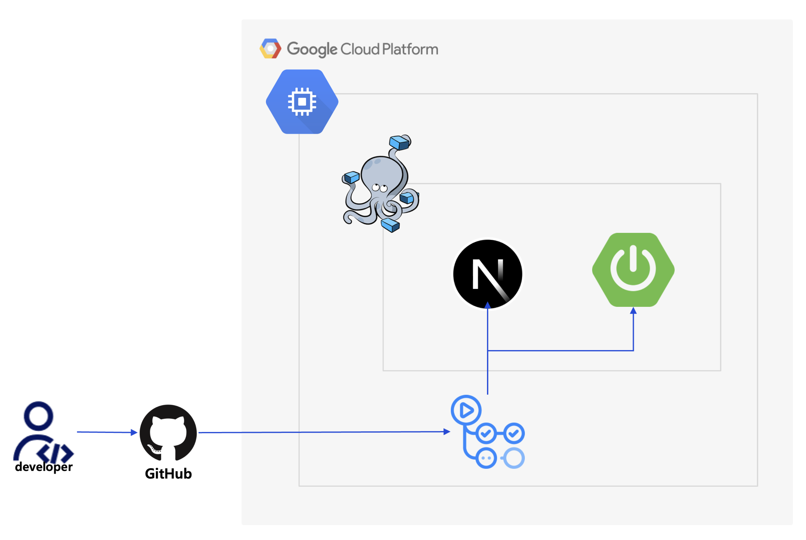

# 💬 대화를 통한 문해력 향상 솔루션, Focusider

> 개발 기간 : 2024.07 ~ 2024.08
>
<div align="center">
  
</div>

<br />

## 🗣️ 프로젝트 개요

초등학생들의 문해력 저하가 사회적 문제로 부각되면서, 학업 전반에서 어려움을 겪는 아이들이 늘어나고 있습니다.
이러한 배경을 바탕으로, 초등학생들의 문해력과 이해력을 체계적으로 개선하기 위한 맞춤형 학습 서비스를
기획하게 되었습니다.
이 서비스는 매일 제공되는 맞춤형 아티클을 읽고, 챗봇과의 상호작용을 통해 이해도를 점검할 수 있으며, 어려운 단어와 문맥에 대한 피드백을 받아 학습 능력을 자연스럽게 향상시킬 수 있도록 돕습니다.

<br />

## 🧑🏻‍💻 배포 정보

배포 URL : https://focusider.shop/

### 로그인 페이지

  
<br />

### 메인 페이지

  
<br />

## 🎮 프로젝트 설치 및 실행 방법

### 1. 설치

```bash
$ git clone https://github.com/gcuswmono/Focusider-BE.git
$ cd Focusider-BE
```

</br>

## 🚀 핵심 기능

### 생성형 AI를 통한 대화 기능

> 생성형 AI를 통한 사용자와의 대화

- SpringAI를 통한 생성형 AI와의 대화 기능을 바탕으로 아티클에 대해 대화 가능
- 사용자와의 대화 내용을 바탕으로 아티클에 대한 사용자의 이해도 파악 및 저장 가능
- 아티클에 대한 요약본을 생성하여 사용자가 아티클을 다시 볼 때 요약본으로 볼 수 있음

### 생성형 AI를 통한 통계 생성 기능

> 사용자의 아티클에 대한 이해도, 읽는데 걸린 시간을 바탕으로 통계 추출

- 매주 월요일마다 이전 주의 모든 사용자에 대한 아티클 기록을 바탕으로 통계 자료 생성 기능
- 읽는데 걸린 시간 + 이해도를 바탕으로 해당 주에 대한 성장 폭이나 하락 폭을 데이터로 생성 가능
- 이를 바탕으로 코멘트를 생성하여 평가 가능(성장 방향 or 부족한 부분)

### 레벨 및 특정 카테고리에 맞는 랜덤 아티클 생성

> 레벨 및 특정 카테고리에 맞는 아티클을 생성형 AI를 기반으로 생성

- 레벨 및 특정 카테고리를 조건으로 생성형 AI로 아티클 생성
- 특정 주기마다 생성하여 다양한 아티클 생성 가능

### 사용자 레벨 및 관심분야에 맞는 아티클 조회

> 사용자의 레벨 및 관심분야에 최대한 맞는 아티클 조회

- 설문을 통해 사용자의 레벨을 설정하고 관심분야(카테고리) 선택 가능
- 사용자 레벨과 관심분야에 맞는 아티클을 랜덤으로 조회
- 한 번 읽었던 아티클(요약까지 끝난)은 다시 조회하지 않아 다양한 아티클 조회 가능

</aside>

</br>

## 👩🏻‍💻 BE 팀원 소개

<table>
  <tr>
    <td align="center" width="150px">
      <a href="https://github.com/ManchanTime" target="_blank">
        
      </a>
    </td>
    <td align="center" width="150px">
      <a href="https://github.com/mango0422" target="_blank">
        
      </a>
    </td>

  </tr>
  <tr>
    <td align="center">
      <a href="https://github.com/ManchanTime" target="_blank">
        이영찬
      </a>
    </td>
    <td align="center">
      <a href="https://github.com/mango0422" target="_blank">
        서용준
      </a>
    </td>
  </tr>

</table>

<br />

## ⚙️ 기술 스택

### Backend
        

### Database
 

### CI/CD
  

## 🔨 아키텍처

### 1. 시스템 아키텍처


</br>

### 2. CI/CD


</br>


### 패키지 구조

```bash
- application
    └── domain
        └── controller
- domain
    └── domain
        ├── dto
        │   ├── res
        │   ├── req
        │   └── info
        ├── domain
        ├── batch
        ├── error
        ├── helper
        ├── mapper
        ├── repository
        ├── type
        │   └── converter
        └── service
- global
    ├── annotation
    ├── aspect
    ├── chat
    ├── config
    │   └── swagger
    ├── domain
    ├── error
    ├── security
    └── utils

```
